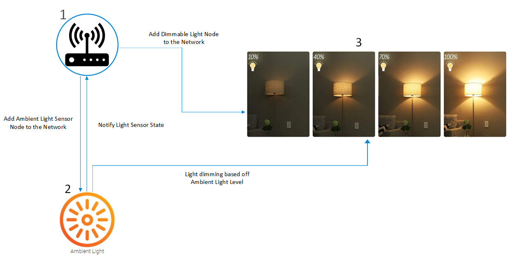
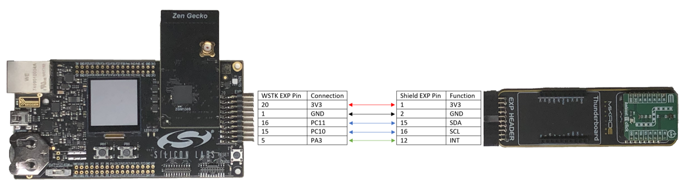
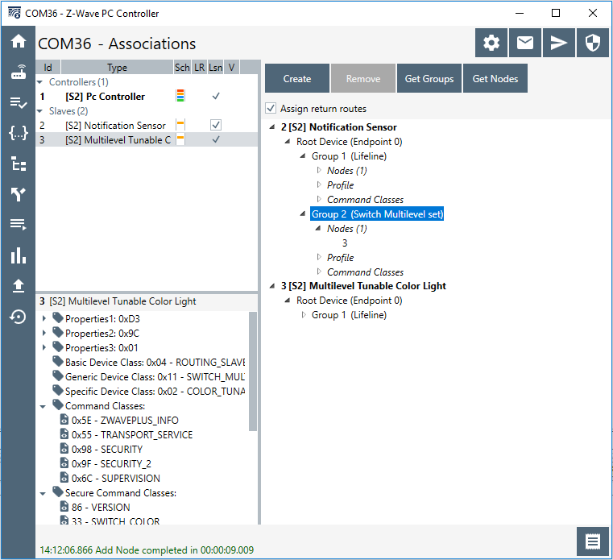
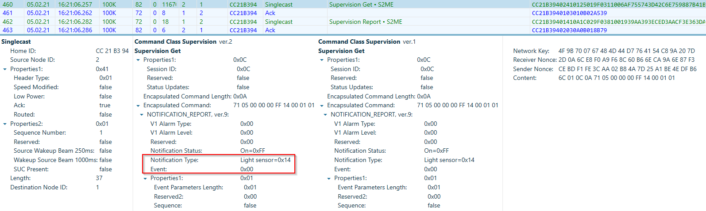

# Z-Wave Ambient Light Sensor Example #

## Summary ##

This example shows the implementation of ambient light sensor in a Z-Wave notification sensor application. The project is based upon the exsiting SensorPIR demo in the Z-Wave SDK. As a reporting sleepy end device, the demo utilizies the interrupt feature of the sensor to operate at EM4 mode. The ambient light sensor(VEML6035) is used to measure the light intensitiy in the environment and will interrupt ZGM130S whenever the light level crosses preset thresholds. The end device(ZGM130S) will then send a light sensor notification to the Z-Wave controller and adjust other dimmable light nodes using the multilevel switch command.

The figure below shows a basic Z-Wave network setup of the demo.

Node 1 is the Z-Wave controller. Node 2 is the Ambient Light Sensor node. Node 3 is the LED Bulb node. 

## Gecko SDK version ##

v3.1.0

## Z-Wave SDK version ##

v7.15.1.0

## Hardware Required ##

- Z-Wave Controller
	- UZB7 Controller USB Dongle

- Ambient Light Sensor Node
	- WSTK Mainboard (BRD4001A)
	- ZGM130S Radio board (BRD4202A)
	- [Ambient 11 Click board from MikroE](https://www.mikroe.com/ambient-11-click)
	- [Silabs Click Shield board from MikroE](https://www.mikroe.com/silabs-click-shield)
	
- LED Bulb Node
	- WSTK Mainboard (BRd4001A)
	- ZGM130S Radio board (BRD4202A)
	- Buttons and LEDs EXP board (BRD8029A)

## Setup ##

First of all, connect the ambient light 11 click board to the silabs click shield through the MikroE socket. Secondly, use jumper wires to connect 5 pins from the click shield expansion header [(schematic)](http://cdn.mikroe.com/product/silabs_%20click_shield/silabs-click-shield-schematic-v102.pdf)  to the WSTK EXP header. Those 5 pins are VDD(3V3), GND, SCL, SDA and INT. See the detailed connection in the figure below. The click shield EXP header pin 1 is at where the white corner is drawn. The main reason that we're not connecting those 2 boards direcly through the EXP header is that the INT pin has to be capable of EM4 wakeup. Unfortunately, there's only one EXP header pin (PA3) that's available when ZGM130S radio board is connected on the WSTK. In addition, we didn't connect VMCU from WSTK EXP header to the 3V3 pin of the click shield board as we'd like to use the Energy Profiler to monitor the currenct consumption of ZGM130S during the development. VMCU can be connected to 3V3 directly to power up the click board.

Next, program the ZGM130S of the Ambient Light Sensor node with the provided z_wave_ambient_light_sensor_zgm130s.sls project and the LED bulb node with 
z_wave_led_bulb_zgm130s.sls project (the same as the LEDBulb demo in SDK) using Simplicity Studio v5.

To create a Z-Wave network, plug the UZB7 Controller USB Dongle into the PC and run the Z-Wave PC controller software to add the Ambient Light Sensor node and the LED Bulb node to the network. After adding those 2 nodes, use the PC controller to create the association. See figure below.

LED bulb node (Node ID 3) should be added to the association group 2 of the Ambient light Sensor node (Node ID 2). Please also note that the Ambient Light Sensor end device is in EM4 mode after included to the Z-Wave network. In order to create the association, the device has to be woken up first. That can be achieved by checking the "Listening Node" check box in the PC Controller first, and then pressing PB1 on the WSTK. After creating the association, press PB1 again to go back to sleep.

## How It Works ##

1. Press PB1 on WSTK to enter learn mode to add/remove the device to the network. Use the PC controller to create the association.

2. After building the Z-Wave network and creating the association, cover the ambient light sensor (VEML6035) on the click board with your fingers. That should simulate a low light condition. The sensor node will signal the LED Bulb node to turn on LED0 using the multilevel switch set command.

3. Use a flash light to shine the ambient light sensor to simulate a strong light condition. The sensor node will in turn signal the LED Bulb node to turn off LED0.

4. The light sensor notification is sent to the controller and can be captured using the Zniffer. See figure below.

## .sls Projects Used ##

- z_wave_ambient_light_sensor_zgm130s.sls
- z_wave_led_bulb_zgm130s.sls

## Special Notes ##

1. The driver of the ambient ligths sensor (VEML6035) is supported in the Gecko SDK v3.1.0.

2. The demo only works with 2 different LUX levels (high/low threshold). If the application requires supporting more LUX levels to control dimmable lights, it cannot operate at EM4 mode. Under EM0/1, ZGM130S can read LUX measurements periodically from the sensor and use some logic to detect LUX level changes.