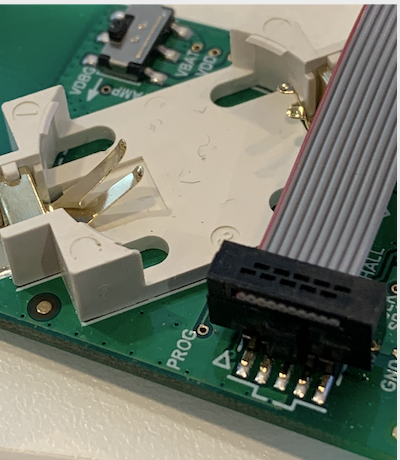
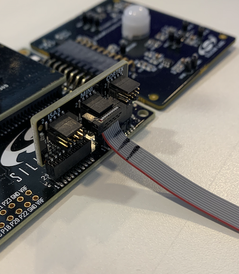
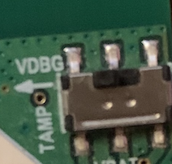
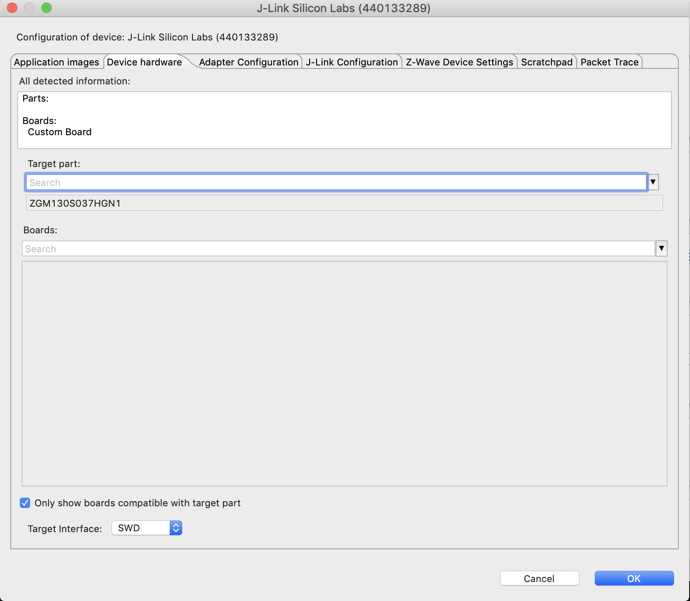

# Contact Sensor


## About
This Z-Wave 700-series based contact sensor "Reference Design" is based on a custom built hardware that is provided along with the software based on SDK 7.14.3.0 (Simplicity Studio v5) in this repository.<br>
Two hardware variations are provided:<br>
<ul>
<li> Reed Switch (SPST) option</li>
<li> Silabs Hall Sensor (Si7210-B-00-IV) option</li>
</ul>
Other hardware components:
<ul>
<li>1 temperature & humidity sensor (Si7021 OR model tbd.)</li>
<li>1 programming button (functionality for: wakeup / inclusion / exclusion / factory reset)</li>
<li>1 tampering button (detect removal of housing)</li>
<li>1 Status LED</li>
<li>1 Chip Antenna (customer version)</li>
<li>1 PCB Antenna (Silabs version)</li>
</ul>

## Project Setup

### Hardware Prerequisites for Debugging
<ul>
  <li>WSTK Development Board</li>
  <li>Custom board</li>
  <li>Simplicity Debug Adapter Board</li>
</ul>

### Software Prerequisites
<ul>
  <li>Simplicity Studio v5 (SSv5)</li>
  <li>Gecko SDK Suite: Z-Wave SDK 7.14.3.0</li>
</ul>

## Hardware Set-Up

All relevant hardware files (Layout, Schematic, BOM) for manufacturing the contact sensor PCB are supplied in the docs folder under "ZGM130S-SENSORS_DESIGN".
For debugging purposes, it is generally advised to mount the Simplicity Mini Header on the PCB, so it can be connected to the WSTK board. This also enables you to make use of the Simplicity Studio Energy Profiler to observe power consumption behaviour during development.<br>
For more info on debugging using the Simplicity Mini Header see AN958: https://www.silabs.com/documents/public/application-notes/an958-mcu-stk-wstk-guide.pdf <br><br>
Connecting the Simplicity Header: <br>
Connect one end of the ribbon cable to the Simplicity Header of the PCB (the 2 triangles facing each other)<br>
<br><br>
Connect the other end of the ribbon cable to the Debug header labeled "Mini"<br><br>
<br><br>
Make sure that while debugging the DIP switch is switched to VDBG (left). If using a coin cell battery switch to the right.<br>
<br><br>

## Simplicity Studio Setup

In Simplicity Studio go to the Launcher menu and right click on the debug adapter board (column on the left) and click on Device Configuration.<br>
Open the "Device Hardware" tab and under "Target Part" search for ZGM130S037HGN/1 and select it. Make sure that the target interface is selected with "SWD" (not JTAG).<br>
<br><br>
Import the project by selecting File -> Import and browse to the location where the z_wave_contact_sensor_zgm130s.sls project file is located. Click "Next" and the project should be imported and visible in the Simplicity IDE.<br>

### Required Modifications
2 files that are part of the SDK need to be modified after importing the project into SSv5<br>
board.h: At line 28 & 29 add:<br>

```
#elif defined(CUSTOM_BOARD)
#include "custom_board.h"
```
board.c: At line 595: remove the "static" keyword from
```
static bool ButtonEnableEM4PinWakeup()
```
The project should now build without any errors or warnings.

## Try it out!

Once you flashed the compiled binary to the board, include the sensor into your Z-Wave network by using the PC Controller Hardware and Software for example and have your Zniffer connected and running as well.<br>
Once it's included, by moving and removing a magnet to / from the sensor or reed switch, a notification report containing the notification type (Home Security: 0x07) an event (0x00 for idle / Door Closed or 0x02 or 0z02 for intrusion / Door Opened) will be sent to the controller.<br><br>
If you included the sensor with S2 security (Unauthenticated or Authenticated), the Notification CC will be encapsulated with a Supervision Get & Report CC.

# Reporting Bugs/Issues and Posting Questions and Comments
<ul>
To report bugs in the Application Examples projects, please create a new "Issue" in the "Issues" section of this repo. Please reference the board, project, and source files associated with the bug, and reference line numbers. If you are proposing a fix, also include information on the proposed fix. Since these examples are provided as-is, there is no guarantee that these examples will be updated to fix these issues.
</ul>
<ul>
  Questions and comments related to these examples should be made by creating a new "Issue" in the "Issues" section of this repo.´
</ul>

# Disclaimer
<ul>
The Gecko SDK suite supports development with Silicon Labs IoT SoC and module devices. Unless otherwise specified in the specific directory, all examples are considered to be EXPERIMENTAL QUALITY which implies that the code provided in the repos has not been formally tested and is provided as-is. It is not suitable for production environments. In addition, this code will not be maintained and there may be no bug maintenance planned for these resources. Silicon Labs may update projects from time to time.
</ul>
