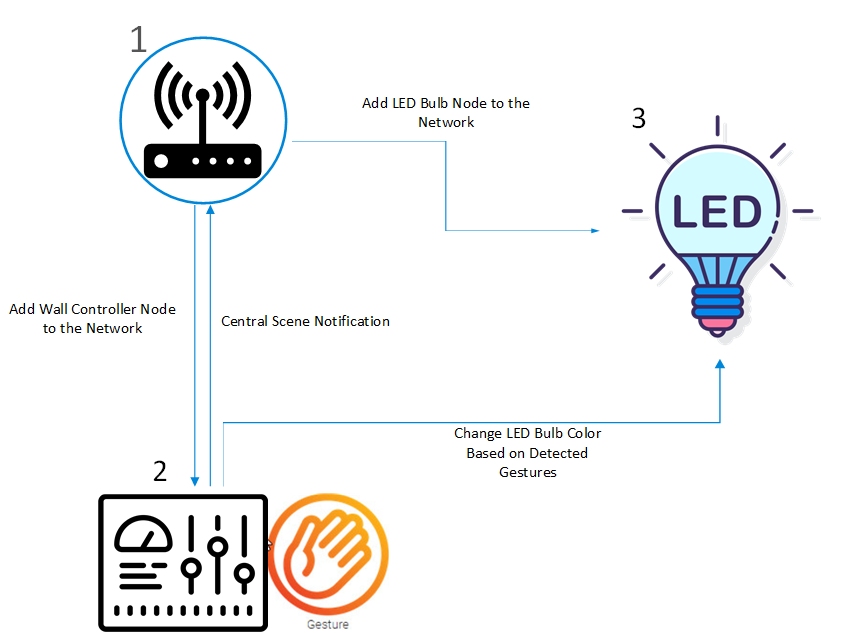
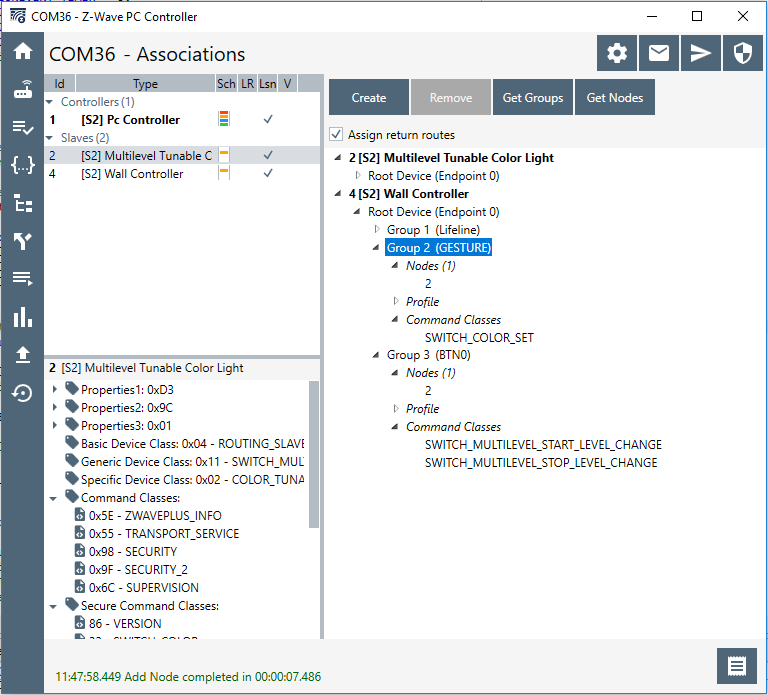

# Z-Wave Gesture Sensor Wall Controller Example #

## Summary ##

This project shows the implementation of gesture detection in a Z-Wave Wall Controller application. The project is based upon the exsiting WallController demo in SDK. Instead of using simple push buttons to controll light sources, the project integrates Si1153 proximity sensor to perform gesture detections. Depending on the detected gesture, the Wall Controller device will change the color of the LED Bulb in the association group.

The figure below shows a basic Z-Wave network setup of the demo.

Node 1 is the Z-Wave controller. Node 2 is the Wall Controller with gesture sensor. Node 3 is the LED Bulb. 

## Gecko SDK version ##

v3.0.0

## Z-Wave SDK version ##

v7.14.1.0

## Hardware Required ##

- Z-Wave Controller
	- UZB7 Controller USB Dongle

- Gesture Sensor Wall Controller Node
	- WSTK Mainboard (BRD4001A)
	- ZGM130S Radio board (BRD4202A)
	- 115xOPT-EXP-EVB (BRD8009A)
	
- LED Bulb Node
	- WSTK Mainboard (BRd4001A)
	- ZGM130S Radio board (BRD4202A)
	- Buttons and LEDs EXP board (BRD8029A)

## Setup ##

In order to build a wall controller node with gesture sensor, 115xOPT-EXP-EVB should be connected to the WSTK board through the expansion board. See figure below. Please make sure that the dip switch on the sensor board is set to GESTURE/ALS (circled in red box). The gesture sensor is placed in the middle of the top row (circled in blue box) on the board. It will drive 3 different LEDs (circiled in green box) to perform proximity measurements. The proximity measurement result will then be passed to a simple algorithm to detect gestures.

Next, program the wall controller node with the provided z_wave_gesture_sensor_wall_controller_zgm130s.sls project and the LED bulb node with 
z_wave_led_bulb_zgm130s.sls project (the same as the LEDBulb demo in SDK) using Simplicity Studio.

To create a Z-Wave network, plug the UZB7 Controller USB Dongle into the PC and run the Z-Wave PC controller software to add the Wall Controller node and the LED Bulb node to the network. After adding those 2 nodes, use the PC controller to create the association between the Wall Controller node and the LED Bulb node. See figure below.

LED bulb node (Node ID 2) should be added to both association group 2 and group 3 of the wall controller (Node ID 4).

## How It Works ##

1. Push BTN1 on WSTK to enter learn mode to add/remove the device to the network.

2. After building the Z-Wave network and creating the association, press and hold BTN0 on WSTK of the Wall Controller Node. That should signal the LED Bulb node to turn on the RGB LED and LED0 (Note that RGB LED has no color yet).

3. Place the hand at about 3cm above the sensor board and move in either the right, left, up or down direction. See figure below.

4. If a move right gesture is detected, the RGB LED will turn red. If a move left gesture is detected, the RGB LED will turn white. If a move up gesture is detected, the RGB LED will turn green. If a move down gesture is detected, the RGB LED will turn blue. 

## .sls Projects Used ##

- z_wave_gesture_sensor_wall_controller_zgm130s.sls
- z_wave_led_bulb_zgm130s.sls

## Special Notes ##

The reliability of gesture detection is affected by the moving speed of the hand and the distance between the hand and the sensor. Since the sensor is sampling at 100Hz, the hand movement cannot be too slow. In addition, the hand has to move across all 3 LEDs at approximate 3cm height.